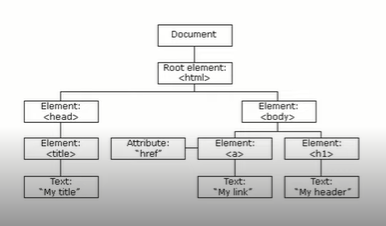
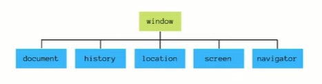

# Aula 1: Entendendo o DOM

## Etapa 1 - O que é?

***Document Object Model***



*O DOM HTML é um padrão de como acessar e modificar os elementos HTML de uma página.*

## Etapa 2 - DOM vs BOM

***BOM:*** *Browser Oject Model*



*Tudo o que está dentro do objeto window*

<br>

# Aula 2: Selecionando elementos

## Etapa 1 - Métodos

**Estrutura HTML**


<br>

***Selecionando os elementos de uma página***


```HTML
<html>
    <head>
        <title>Minha página</title>
    </head>
    <body>
        <h1 id="titulo>Minha página"></h1>

        <section class="textos">
            <h2>Sobre mim</h2>
            <p>Texto sobre a pessoa aqui.</p>
        </section>
        
        <section class="textos">
            <h2>Meus projetos</h2>
            <ul>
                <li>Projeto 1</li>
                <li>Projeto 2</li>
                <li>Projeto 3</li>
            </ul>
        </section>

    </body>
</html>
```

```js
document.getElementById("titulo");
// <h1 id="titulo>Minha página"></h1>
```

```js
document.getElementByTagName("li");
/*
[
    <li>Projeto 1</li>
    <li>Projeto 2</li>
    <li>Projeto 3</li>
]
*/
```

```js
document.getElementByClassName("textos");
/*
[
   <section class="textos">
        <h2>Sobre mim</h2>
        <p>Texto sobre a pessoa aqui.</p>
    </section>
        
    <section class="textos">
        <h2>Meus projetos</h2>
        <ul>
            <li>Projeto 1</li>
            <li>Projeto 2</li>
            <li>Projeto 3</li>
        </ul>
    </section>
]
*/
```

<br>

```HTML
<html>
    <head>
        <title>Exemplo querySelectorAll</title>
    </head>

    <body>

        <div class="primeira-classe segunda-classe">
            <ul>
                <li class="opcao">opção 1</li>
                <li class="opcao">opção 2</li>
                <li class="opcao">opção 3</li>
            </ul>
        </div>

    </body>
</html>
```

```js
document.querySelectorAll(".primeira-classe .segunda-classe");
/*
[
   <div class="primeira-classe segunda-classe">
        <ul>
            <li class="opcao">opção 1</li>
            <li class="opcao">opção 2</li>
            <li class="opcao">opção 3</li>
        </ul>
    </div>
]
*/
```

```js
document.querySelectorAll("li .opcao");
/*
[
    <li class="opcao">opção 1</li>
    <li class="opcao">opção 2</li>
    <li class="opcao">opção 3</li>
]
*/
```


### **Adicionar e deletar**

<table style= "border:1px solid black;">
    <tr>
        <th style="text-align: center">Método</th>
        <th style="text-align: center">Descrição</th>
    </tr>
    <tr>
        <td>document.create.Element(element)</td>
        <td>Cria um novo elemento HTML</td>
    </tr>
    <tr>
        <td>document.removeChild(element)</td>
        <td>Remove um elemento</td>
    </tr>
    <tr>
        <td>document.appenChild(element)</td>
        <td>Adiciona um elemento</td>
    </tr>
    <tr>
        <td>document.replaceChild(new, old)</td>
        <td>Substitui um elemento</td>
    </tr>
</table>

<br>

# Aula 3: Trabalhando com estilos

**Element.classList**

```HTML
<div id="meu-elemento" class="classe">
    <!-- resto do código aqui -->
</div>
```

```js
const meuElemento = document.getElementById("meu-elemento");

meuElemento.classList.add("novo-estilo");
// Adiciona a classe "meu-estilo"

meuElemento.class.remove("classe")
// Remove a classe "classe"

meuElemento.classList.toggle("dark-mode");
// Adiciona a classe "dark-mode" caso ela não faça parte da lista e remove ela caso faça
```

```HTML
<div id="meu-elemento" class="novo-estilo dark-mode">
    <!-- resto do código aqui -->
</div>
```

<br>

**CSS**

*Acessando diretamente o CSS de um elemento*

```js
document.getElementByTagName("p").style.color = "blue";
```

<br>

# Aula 4 - Eventos

## Etapa 1 - Tipos

### **Eventos do mouse**

* *mouseover*
* *mouseout*

### **Eventos de click**

* *click*
* *dbclick*

### **Eventos de atualização**

* *change*
* *load*

<br>

## Etapa 2 - Acionando eventos

**Event listener**

*Diretamente no javascript, cria um evento que vai ser acionado no momento em que o usuário realizar determinada ação.*

```js
const botao = document.getElementById("meuBotao");

botao.addEventListener("click", outraFuncao);
```

**Atributo HTML**

```HTML
<html>
    <body>
        <h1> onclick="mudaTexto(this)">Clique aqui!</h1>

        <script>
            function mudaTexto(id) {
                id.innerHTML = "Mudei!";
            }
        </script>
    </body>
</html>
```
*Especifica a função a ser chamada diretamente no elemento HTML.*